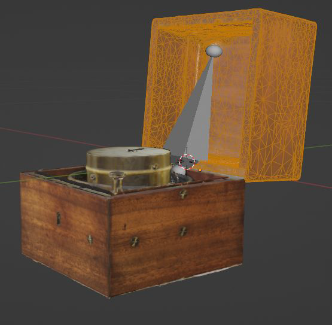
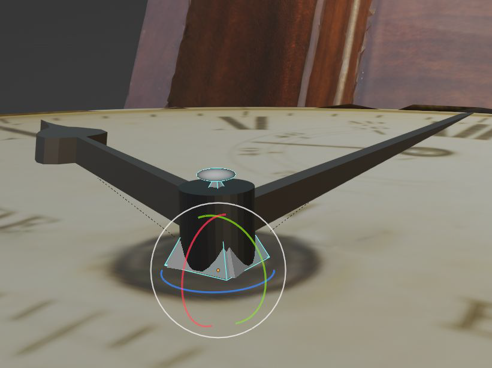
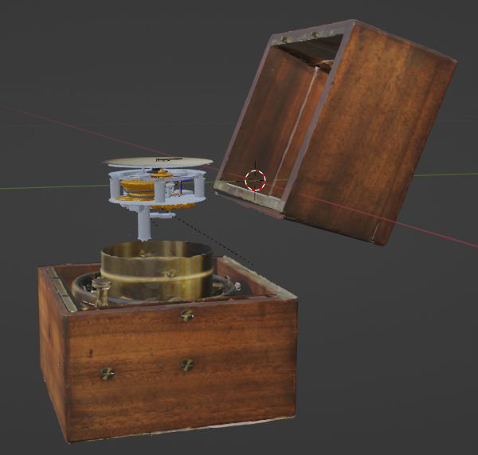

# Chronometer Project

## 🕰️ Project Overview

This project is a digital recreation of a **maritime chronometer**, scanned with a **CT scanner** and brought to life in **Blender**. The animation created in Blender showcases how each part of the chronometer functions, simulating the dynamic operation of the clock in real time.

The project culminates in a web app built with **Three.js**, allowing users to interact with the chronometer via an intuitive interface, exploring its parts and receiving detailed information about its mechanisms.

  
  
  

## 🔧 Technologies Used
- **Blender**: For 3D modeling and animation of the chronometer.
- **Three.js**: For building an interactive web-based 3D viewer.
- **CT Scanner**: For accurate 3D scanning of the chronometer.

## 🚀 Features
- **Dynamic Simulation**: Real-time simulation of the chronometer's mechanics.
- **Interactive Web App**: Users can rotate, zoom, and interact with the chronometer, with options to view detailed descriptions of each component.
- **Informative Interface**: Provides a user-friendly interface to explore and learn about the chronometer.
